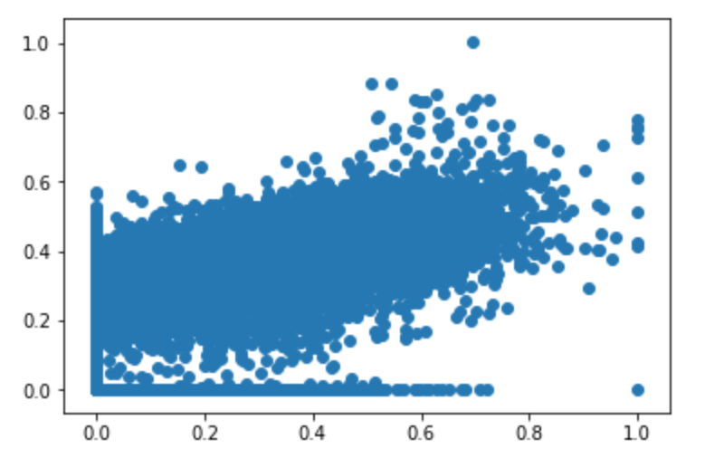

```{r setup, include=FALSE}
knitr::opts_chunk$set(echo = TRUE)
```

###<span style = "color:#588bae">Objective</span> 
Given a download dataset, try to make a machine learning model to predict downloads based on several dataset.

###<span style = "color:#588bae">Preparing Data</span>
 - After doing some pre-analysis and discussion, we decided that we are going to use 4 dataset, joining them together and made our training dataset. The four datasets are: downloads, song_info, jam_to_msd, train_triplets. We figured that we should have all the feature we needed to make a pretty accurate prediction.
 - Aggregated jam_to_msd and train_triplets.
 These 2 features are recorded based on users. If we were to joint them with song_info, we had to first aggregated  them on songs. Easy to do in spark but not at all trivial.
 - From 30k to 800k
 First we filtered out the corrupted columns and did an inner joint on all 4 of the above dataset, and ended up with a csv file with only 30k rows. Several steps we took to get better:
  1) Only doing an inner joint between song_info and downloads, and then left joint the other 2 with the result obtained. And we filled in the null values with 0. This gives us around 400k rows.
  2) We found that after filtering out the corrupted columns, only 580w rows remains in song_info, thus resulting only 400k remaining. We tried to filled in the missing value by the techniques as follow:
Based on the assumption of the same artist produced kind of similar songs, we produced an artist_average.csv, which contains the average of the feature for every artist exist. Because almost all songs in song_info has an artist_id except 3, if we're able to make this file, we can fill in all the missing cells.
However, when we tried to do that, we found that among 40k artist, there're 8600 of them with average song hottness as NA. In order to solve this, we look into the remaining feature, and had this interesting finding:
Where x axis is song hottness and y axis is artist hottness. We can see there's a strong correlation between these 2, thus we fill in those missing song hottness with the corresponding artist hottness.



  This gives us a new dataset with around 680k rows. Still rooms to improve.

3) After carefully looking at the downloads set, we found that artist name and song title are not very clean. So we do the following:
I.   Convert them to lower cases
II.  Remove blank space and all the punctuation.
III. Remove "and", "feat", "vs"
Finally, we have a dataset with 800k songs, which covers around 80% of the overall data. For those that were not in our dataset, we think most likely nobody really cares about them. So we'll predict 0 for them, can't be too wrong.

###<span style = "color:#588bae">Feature Selection</span>
- Step 1: Pearson correlation. This gives us an intuition of how closely a certain feature is related to the model.

Features                          | RSME
----------------------------------|-------------------------------
familiarity                       | 0.40
Artist_hot                        | 0.84
duration                          |	0.77
loudness                          |	-0.75
song_hotness                      |	0.71
tempo                             |	0.86
mean_price                        |	0.98
Jam_count(filled with 0)          | 0.09
Jam_count(without filling)        | 0.87
taste_count(filled with 0)        | 0.05
taste_count(without filling)      | 0.64

It's interesting to see that taste_count(filled with 0) and Jam_count(filled with 0) almost have no relation with label. Filling 0 blindly hurts the model accuracy. Another interesting fact is that mean price is closely (and positive) related to label, which suggest a higher price implies a higher download, which is very un-expected.

But there're some drawbacks: since it only shows the linear correlation, and there could some high dimensional relation between the feature and the label. 

- Step 2: Pick all the features above(with high correlation), train a random forest model on a randomly selected subset(with non-linearity imposed)

- Step 3: Deleting the model on at each time and recorded the error, which is a practical way (especially in non-linear system) to determine which feature has a big impact on the model.
At the end we had a table looks like this:

Features                          | RSME
----------------------------------|-------------------------------
All Features                      | 200
without mean_price                | 1809
without taste_count               |	220
without jam_count                 |	197
without familiarity               |	230
without artistHotness             |	356
without duration                  |	256
without loudness                  | 230
without song_hottness             | 221

###<span style = "color:#588bae">Implementation</span>
- Step 1: run `getCleanedSongInfo.scala` to get a new data set containing needed features:
In this step, we first fetched average features of each artist. Especially, filled *Song Familarity* by 0.5 if there is no song familiarity for one artist, where 0.5 is average of song familiarity in whole data set; filled *Song Hotness* by artist hotness, which as we talked in **Preparing Data** part; if there is no artist hotness, remove this row. Second, we selected the needed feature from song_info.csv, and then join with average features on *artist_id*. Finally, we got a mergedSongInfo

- Step 2: run `JoiningTable.scala` to get data set for training:
In this step, we first inner join mergedSongInfo with download.csv on combined key: *ArtistName_Title*, then we sequentially left join with jam_count on *track_id*, left join taste_count on *song_id*. After removing the String column, we got our training set. We make use of the dataframe in spark to make efficient join.

- Step 3: run `LinearRegression.scala`, `RandomForestRegression.scala`, `GBTRegression.scala` to training model separately.
In each model, we used built-in function from org.apache.spark.ml._

- Step 4: run `Prediction.scala` with input query and model to predict result.

###<span style = "color:#588bae">Machine Learning Model Selection</span>
-  We implemented our machine learning model in Spark MLlib, and ran the training process in aws EMR cluster and save the trained model for prediction later.

-  We tried a bunch of models: linear regression, random forest, gradient boosted tree. Each model has its own pros and cons, we report them as follow:
  In comparison of training speed, we have Linear Regression > random forest > gradient boosted tree, which are conducted on a dataset of 820K data points. Linear Regression can converge within 10 minutes on a local machine ; Gradient boosted tree can be trained within 2 hours on a 5 nodes c4.2xLarge cluster. Random Forest can be trained within 3 hours on the same cluster.
  
  As for the validation performance, we conducted predictions on a 820 K dataset.  Linear Regression obtains RMSE around 230; Random Forest has RMSE of 110. Gradient Boosted tree has the optimal RMSE Of 73.
  
  Also, since we save the trained model and load the pretrained model when making prediction, we also pay attention to the size of the saved model which are trained on a 820k dataset. Linear Regression has the smallest size around 1MB; Gradient Boosted tree has size around 30 MB; Random forest has the largest size of 200MB.
  
  What's interesting is that we observed the parallelism level showed by the DAG of gradient boosted tree is very low, since the algorithm is iteratively running. In contrast, random forest showed a high level of parallelism, which makes it faster than the gradient boosted tree.
  
  Based on above observations, we decided to use the gradient boosted tree, which has the optimal RMSE and proper model size.


###<span style = "color:#588bae">Prediction</span>
-  During prediction, we wrote a getEvaluationDataFrame function to obtain a dataframe that contains the features needed to feed in the model. In getEvaluationDataFrom, we created 2 dataframe: one for query and one for our dataset, and then do a left join on query dataframe. There're several advantages: first, we don't have to go through the whole dataset for each query. Second, for the artist and titles that are not in the dataset, we fill 

###<span style = "color:#588bae">Conclusion</span>
- GBT gives the best result, we had a model achieved RSME = 26, but it took a long time to train (12 hours on aws with 5 c4.2x large nodes) and too big to fit in the jar (190M). 
- Linear regression seems to be a bottom line: it runs fast and yields RMSE around 230.
- Adding bad features, like taste_count filling with 0 for nulls hurts model accuracy. So it's better to leave out those features rather than inserting wrong values.
- We thought about using different models for samples with different number of features, it did increase accuracy a little bit but again the both the model and the dataset will be too big to fit in 100m.

